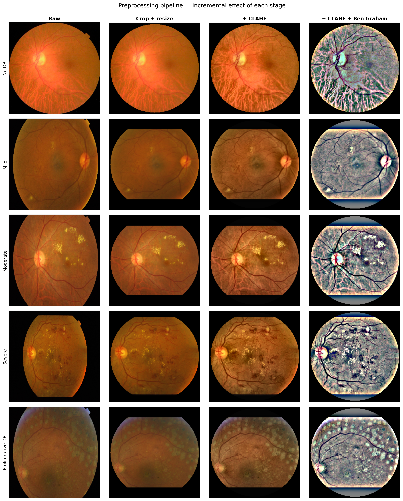
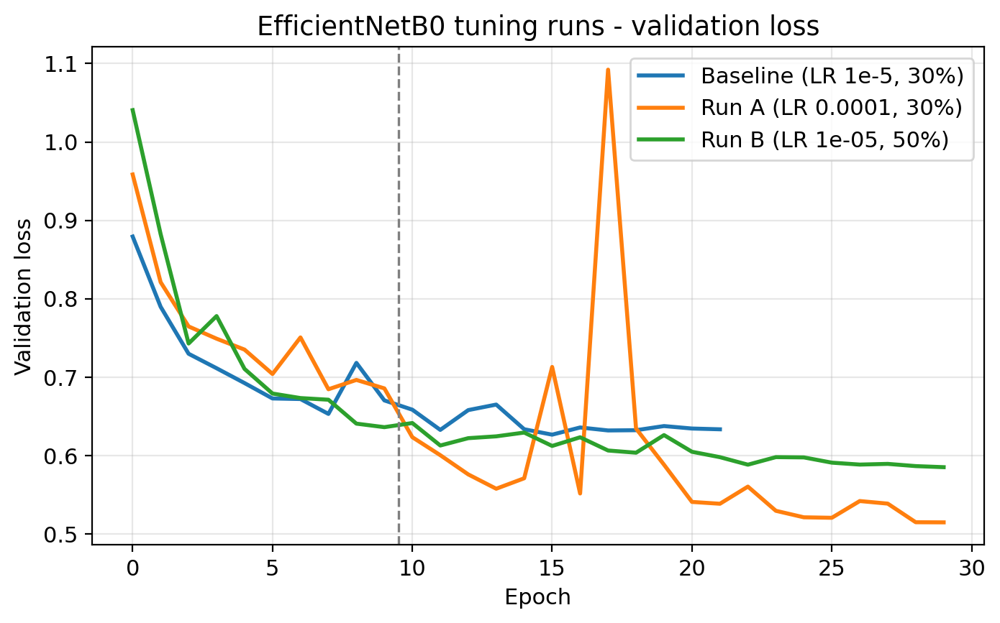
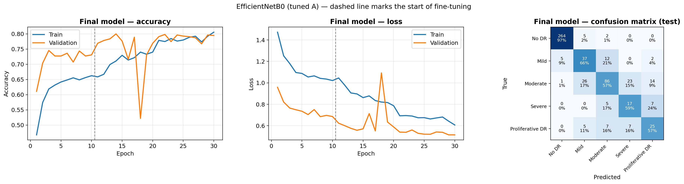
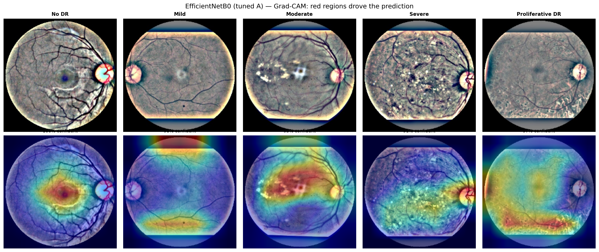
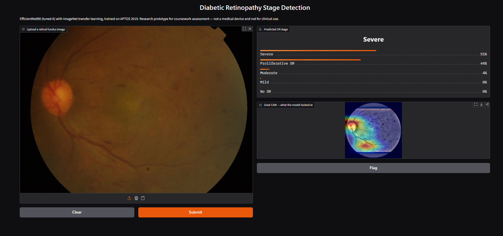

# Diabetic Retinopathy Stage Detection

Five-class diabetic retinopathy (DR) grading from retinal fundus photographs, using retina-specific image preprocessing, domain-constrained augmentation and CNN transfer learning on the APTOS 2019 dataset.

**Module:** Computer Vision — Coursework 1
**Programme:** BSc (Hons) Computer Science, NIBM / Coventry University
**Author:** S.M.A.D.V.D. Sammandapperuma
**NIBM Index:** COBSCCOMP242P-008 · **Coventry Index:** 16114173

📺 **Video demonstration:** [ADD YOUR YOUTUBE LINK HERE]


> ⚠️ **Disclaimer:** This is a research prototype built for academic coursework. It is **not a medical device**, has no regulatory validation, and must not be used for clinical decisions.

---

## 1. Overview

Diabetic retinopathy is a leading cause of preventable blindness. Its early stages are asymptomatic, so detection depends on screening retinal photographs at a scale human graders cannot sustain. This project builds an automated grader that classifies a fundus photograph into one of five stages of the International Clinical DR Severity Scale.

| Grade | Stage | Key findings on fundus photograph |
|:---:|---|---|
| 0 | No DR | No abnormalities |
| 1 | Mild NPDR | Microaneurysms only |
| 2 | Moderate NPDR | More than microaneurysms but less than severe |
| 3 | Severe NPDR | 4-2-1 rule; no neovascularisation |
| 4 | Proliferative DR | Neovascularisation and/or vitreous haemorrhage |

### Headline results

The final model is **EfficientNetB0 fine-tuned at a learning rate of 1e-4**, selected on validation data only and evaluated once on an untouched test set of 550 images.

| Metric | Value |
|---|---|
| Test accuracy | **78.0%** |
| Macro F1 | **0.639** |
| Quadratic weighted kappa (QWK) | **0.870** |
| Macro one-vs-rest AUC | **0.931** |
| Referable DR sensitivity | **85.7%** |
| Referable DR specificity | **95.1%** |
| Parameters | 4.06 M (~16 MB float32) |

Collapsed to the refer / do-not-refer decision a screening programme actually makes, the model meets the widely cited targets of at least 80% sensitivity and 95% specificity.

---

## 2. Dataset

**APTOS 2019 Blindness Detection** — 3,662 clinically graded fundus photographs from Aravind Eye Hospital, India.

The Kaggle competition download requires identity verification, so the same images were obtained at original resolution from the public mirror [`mariaherrerot/aptos2019`](https://www.kaggle.com/datasets/mariaherrerot/aptos2019). The competition's own test set is unlabelled and therefore unusable for evaluation; the mirror's three labelled folders were **pooled and re-split** with a stratified partition created in this project.

| Grade | Class | Images | Share | Imbalance vs. No DR |
|:---:|---|---:|---:|---:|
| 0 | No DR | 1,805 | 49.3% | 1.0× |
| 1 | Mild | 370 | 10.1% | 4.9× |
| 2 | Moderate | 999 | 27.3% | 1.8× |
| 3 | Severe | 193 | 5.3% | **9.4×** |
| 4 | Proliferative DR | 295 | 8.1% | 6.1× |

**Split:** 70 / 15 / 15, stratified by class, seed 42 → **2,562 train / 550 validation / 550 test**. No class proportion deviates by more than 0.11 percentage points between splits.

Because half the dataset is No DR, a model that always predicted No DR would score 49.3% accuracy while being clinically useless — which is why per-class recall, macro F1 and QWK are reported alongside accuracy.

---

## 3. Preprocessing pipeline

Rather than applying generic preprocessing, three defects were **measured** in a 400-image audit of the raw data, and each pipeline stage corrects one of them.

| Measured defect | Pipeline response |
|---|---|
| Resolution varies 0.3–12 MP across 14 distinct sizes | Bounding-box crop → pad to square → resize to 320×320 |
| Mean brightness varies from 18 to 121 | **CLAHE** on the LAB luminance channel (contrast adjustment) |
| ~23% of every frame is black background | Tight crop + circular field-of-view mask |
| Lesions are low-contrast | **Ben Graham** local-average subtraction (edge enhancement) |

1. **Crop, pad, resize** — tightest box of pixels brighter than 7, zero-padded to square so the retina is not distorted, resized with area interpolation.
2. **CLAHE** (`clipLimit=2.0`, `tileGridSize=8×8`) applied **only to the L channel of LAB**. Equalising R, G and B separately shifts hue, destroying the colour difference between dark-red haemorrhages and yellow-white exudates.
3. **Ben Graham** (`σ=10`): `out = 4·img − 4·GaussianBlur(img, σ) + 128`. A high-pass / unsharp-mask filter that removes smooth illumination gradients and amplifies vessel edges and small lesions.
4. **Circular mask** (radius × 0.97) removes the bright aperture-rim artefact some cameras produce.

**No denoising filter was applied, deliberately** — a microaneurysm is only a few pixels wide, and a median blur would erase the very lesion that separates grade 0 from grade 1. Noise amplification is instead bounded by the CLAHE clip limit.

### Quantitative evidence

| Measure | Raw | Preprocessed |
|---|---:|---:|
| Mean RMS contrast | 17.32 | **46.53** (+168.6%) |
| Coefficient of variation | 0.318 | **0.148** |

Contrast is both raised and standardised across images.



---

## 4. Augmentation and class imbalance

**Augmentation is applied to the training set only**, on the GPU, re-drawn every epoch.

| Transform | Setting | Justification |
|---|---|---|
| Random flip | Horizontal + vertical | A retina has no canonical orientation |
| Random rotation | ±54° | Camera and head rotation vary |
| Random zoom | ±10% | Field-of-view differences |
| Random translation | ±5% | Imperfect centring |
| Random contrast | ±10% | Mild exposure variation |
| Random brightness | ±10% | Illumination differences between clinics |

**Explicitly rejected:** shear and elastic deformation (distort diagnostic vessel geometry), hue and channel shifts (destroy lesion colour semantics), Cutout / random erasing (may delete the single microaneurysm defining grade 1).

**Class imbalance** was handled with a weighted loss rather than resampling — oversampling would duplicate the 193 Severe images many times (overfitting risk), undersampling would discard most of the 1,805 No DR images. Weights come from `compute_class_weight("balanced")` on the **training split only**:

```
No DR 0.406 | Mild 1.986 | Moderate 0.733 | Severe 3.796 | Proliferative DR 2.475
```

A Severe example therefore contributes about **9.4×** the loss of a No DR example.

---

## 5. Model and transfer learning

Three ImageNet-pretrained backbones were compared under identical conditions, each paired with its own required input normalisation (a common silent bug if mismatched).

| Architecture | Params | Design idea | Why included |
|---|---:|---|---|
| EfficientNetB0 | 4.06 M | Compound scaling, MBConv + SE | Best accuracy per parameter |
| ResNet50 | 23.60 M | Residual skip connections | Standard high-capacity baseline |
| MobileNetV2 | 2.26 M | Depthwise-separable convolutions | Deployment realism (phone-capable) |

**Head:** `GlobalAveragePooling2D → Dropout(0.4) → Dense(5, softmax, dtype=float32)` — only 6,405 trainable parameters. Float32 output because softmax is unstable in float16 under mixed precision.

**Transfer learning is implemented in three places:**
1. `weights="imagenet"` loads pretrained weights; `include_top=False` drops ImageNet's 1000-class classifier.
2. A new five-class head is attached.
3. A two-stage schedule uses the backbone first as a frozen feature extractor, then fine-tunes its deepest layers.

### Two-stage fine-tuning

| Stage | Backbone | LR | Epochs | Rationale |
|---|---|---|---|---|
| 1 | Fully frozen | 1e-3 | 10 | The random head emits large gradients that would destroy pretrained weights |
| 2 | Top 30% unfrozen | 1e-4 (final) | ≤20 | Deep layers hold ImageNet semantics needing re-specialisation |

Unfrozen layers: **57/238** (EfficientNetB0), **37/175** (ResNet50), **31/154** (MobileNetV2).

**BatchNormalization layers stay frozen throughout.** An unfrozen BN layer updates its running statistics from small batches of the new domain, corrupting the statistics the pretrained convolutions depend on — the classic symptom is training accuracy climbing while validation accuracy collapses.

---

## 6. Training strategy

| Setting | Value |
|---|---|
| Input size | 224×224×3 |
| Batch size | 32 |
| Optimiser / loss | Adam / sparse categorical cross-entropy + class weights |
| Precision | Mixed float16, float32 output |
| Seed | 42 (Python, NumPy, TensorFlow) |
| Hardware | NVIDIA Tesla T4 (Google Colab) |
| Software | TensorFlow 2.20, Keras 3.13, Python 3.13 |

**Callbacks:** `EarlyStopping` (val_loss, patience 6, restore best weights) · `ReduceLROnPlateau` (factor 0.3, patience 3) · `ModelCheckpoint` (best val_loss, saved to Drive).

Validation **loss** is monitored rather than accuracy, because under class weighting accuracy is dominated by the majority class and can stay flat while the model improves on rare grades.

A `QUICK_RUN` flag executes the entire pipeline on a small stratified subset in about five minutes, so bugs surface before a multi-hour run.

### Hyperparameter tuning

The two fine-tuning hyperparameters with the largest effect were tested on EfficientNetB0, compared on **validation QWK only**.

| Run | Fine-tune LR | Unfrozen | Question tested | Val QWK | Best val loss |
|---|---:|---:|---|---:|---:|
| Baseline | 1e-5 | 30% | Reference | 0.8034 | 0.6266 |
| **A (selected)** | **1e-4** | **30%** | Is the baseline LR too cautious? | **0.8571** | **0.5147** |
| B | 1e-5 | 50% | Does adapting more of the backbone help? | 0.8405 | 0.5851 |

Run A never triggered early stopping — it ran all 20 fine-tuning epochs with its best at the final one, so the baseline learning rate was indeed too cautious and the model was still improving when training ended.



---

## 7. Results

All five candidates. **Selection uses validation QWK; every other column is the held-out test set.**

| Model | Val QWK | Test Acc | Macro F1 | Test QWK | Macro AUC | Params |
|---|---:|---:|---:|---:|---:|---:|
| EfficientNetB0 (baseline) | 0.8034 | 0.7618 | 0.5964 | 0.8313 | 0.9121 | 4.06 M |
| ResNet50 | 0.8393 | 0.7418 | 0.5681 | 0.8411 | 0.9098 | 23.60 M |
| MobileNetV2 | 0.7914 | 0.7018 | 0.5292 | 0.8074 | 0.9098 | 2.26 M |
| **EfficientNetB0 (tuned A)** | **0.8571** | **0.7800** | **0.6394** | **0.8700** | **0.9312** | 4.06 M |
| EfficientNetB0 (tuned B) | 0.8405 | 0.7673 | 0.6101 | 0.8462 | 0.9190 | 4.06 M |

Two findings: among the untuned baselines **ResNet50 was strongest**, contradicting the initial hypothesis that a smaller model suits small data; and after tuning **EfficientNetB0 overtook it with ~6× fewer parameters**.

### Per-class performance (final model)

| Class | Precision | Recall | F1 | Support |
|---|---:|---:|---:|---:|
| No DR | 0.978 | 0.974 | **0.976** | 271 |
| Mild | 0.507 | 0.661 | 0.574 | 56 |
| Moderate | 0.768 | 0.573 | 0.656 | 150 |
| Severe | 0.362 | 0.586 | 0.447 | 29 |
| Proliferative DR | 0.521 | 0.568 | 0.543 | 44 |
| **Macro average** | **0.627** | **0.672** | **0.639** | 550 |

No DR is recognised almost perfectly — the most important property for screening triage. Severe shows recall above precision, which is the class weighting at work: over-grading costs an extra referral, under-grading can cost sight.



> **On the curves:** validation sits *above* training, which is expected rather than an error — training metrics use augmented images with dropout active and a class-weighted loss, while validation uses clean images and an unweighted loss. Validation loss is still decreasing at the final epoch, so there is no classic overfitting.

### Error analysis

Of 550 test images the model made **121 errors**, of which **74% (90) were between adjacent grades** and 46% were under-gradings. The dominance of adjacent errors shows the model learned the ordinal structure of the disease — which is also why QWK (0.870) far exceeds accuracy (0.780).

**Moderate is the hub of confusion**, mistaken for both Mild (26) and Severe (23). That boundary depends on counting haemorrhages across all four quadrants (the 4-2-1 rule), which is hard at 224×224 and is also where human graders disagree most.

### Interpretability



Grad-CAM heatmaps are largely clinically plausible — attention on exudate clusters for Moderate, the lesion-dense retina for Severe, the healthy macula for No DR. Reported honestly: for the Mild example part of the attention falls on the flat top edge of the field of view, a camera artefact rather than a lesion, suggesting the model may exploit border cues on some cameras.

---

## 8. Prototype

A Gradio interface accepts a **raw** fundus photograph, applies the identical four-stage preprocessing pipeline used in training, and returns probabilities for all five stages plus a Grad-CAM overlay. Applying the pipeline at inference time is essential — without it the model would receive images unlike anything it was trained on.



---

## 9. Repository structure

```
.
├── notebooks/
│   ├── 01_data_preprocessing.ipynb          # EDA, preprocessing, caching, split, class weights
│   └── 02_model_training_evaluation.ipynb   # augmentation, transfer learning, tuning, evaluation, demo
├── figures/                                 # all report figures (PNG)
├── results/
│   ├── architecture_comparison.csv
│   ├── final_model_comparison.csv
│   ├── hyperparameter_tuning.csv
│   ├── final_model_per_class_metrics.csv
│   ├── final_model_error_pairs.csv
│   ├── class_weights.json
│   └── final_summary.json
├── report/
│   └── DR_Stage_Detection_Report.pdf
└── README.md
```

Not tracked in git (see `.gitignore`): the raw dataset (~8 GB), the preprocessed cache (`processed_320.zip`, 217 MB), trained `.keras` models, and `kaggle.json`.

---

## 10. Reproducing the results

### Full pipeline (~3 hours on a T4)

1. Open `notebooks/01_data_preprocessing.ipynb` in Google Colab.
2. Run it once, uploading your Kaggle API token when prompted. It writes the preprocessed cache, split CSVs and class weights to `MyDrive/DR_CW/`.
3. Open `notebooks/02_model_training_evaluation.ipynb` with a **T4 GPU** runtime and run all cells. Five training runs take about three hours.
   Set `QUICK_RUN = True` for a ~5-minute smoke test of the whole pipeline first.

All seeds are fixed at 42, though GPU non-determinism can cause small run-to-run differences.

### Demo only (no retraining, ~10 minutes)

If `MyDrive/DR_CW/models/EfficientNetB0_tuneA_final.keras` already exists, run only: setup cells → `grad_cam` definitions → the model-reload cell → raw demo images → `pip install gradio` → inference preprocessing → the Gradio cell. A CPU runtime is sufficient.

### Requirements

```bash
pip install -r requirements.txt
```

Developed on Google Colab (Python 3.13, TensorFlow 2.20, Keras 3.13, CUDA via Tesla T4).

---

## 11. Limitations

- **Small rare-class test sets** — 29 Severe and 44 Proliferative test images; one image moves Severe recall by ~3.4 percentage points.
- **Single dataset, single seed** — one hospital network in India, no external validation on other populations or cameras.
- **Resolution** — at 224×224 a microaneurysm spans only a few pixels, limiting Mild detection.
- **Ordinal structure not modelled** — the loss treats the five grades as unrelated categories even though QWK rewards ordinal accuracy.
- **Possible shortcut learning** — Grad-CAM showed attention on a field-of-view border in at least one case.
- **No patient-level split** — both eyes of one patient could fall on opposite sides of the split.
- **Label noise** — human graders disagree on DR staging, especially between adjacent grades.

## 12. Future work

- Train EfficientNetB3 at 300×300 (the cache was stored at 320×320 deliberately to allow this without re-processing).
- Ordinal regression with optimised thresholds, or an ordinal loss, to target QWK directly.
- Longer training for Run A, a wider tuning grid, and multiple seeds for confidence intervals.
- External validation on Messidor-2 or IDRiD; patient-level splitting where identifiers exist.
- Test-time augmentation and an EfficientNetB0 + ResNet50 ensemble (they make different errors).
- TensorFlow Lite 8-bit quantisation (~4 MB) with an image-quality gate for offline mobile use.

---

## 13. Ethical considerations

- Images are de-identified public research data; no patient metadata is included.
- The mirror's licence is listed as *Unknown* on Kaggle, so the data is used solely for non-commercial academic coursework and is **not redistributed in this repository**.
- All images come from one hospital network, so performance on other populations is unverified and local re-validation would be required before any use.
- A false negative in DR screening can lead to irreversible blindness, so any deployed system must keep a clinician in the loop and be tuned towards sensitivity.
- A system influencing clinical decisions is a medical device requiring regulatory approval and prospective trials. **This prototype makes no such claim.**

---

## 14. References

- Asia Pacific Tele-Ophthalmology Society (2019) *APTOS 2019 Blindness Detection*. Kaggle.
- Cohen, J. (1968) 'Weighted kappa', *Psychological Bulletin*, 70(4), pp. 213–220.
- Deng, J. et al. (2009) 'ImageNet: a large-scale hierarchical image database', *CVPR*, pp. 248–255.
- Graham, B. (2015) *Kaggle Diabetic Retinopathy Detection competition report*. University of Warwick.
- Gulshan, V. et al. (2016) 'Development and validation of a deep learning algorithm for detection of diabetic retinopathy', *JAMA*, 316(22), pp. 2402–2410.
- He, K. et al. (2016) 'Deep residual learning for image recognition', *CVPR*, pp. 770–778.
- Sandler, M. et al. (2018) 'MobileNetV2: inverted residuals and linear bottlenecks', *CVPR*, pp. 4510–4520.
- Selvaraju, R.R. et al. (2017) 'Grad-CAM: visual explanations from deep networks', *ICCV*, pp. 618–626.
- Tan, M. and Le, Q. (2019) 'EfficientNet: rethinking model scaling for CNNs', *ICML*, pp. 6105–6114.
- Wilkinson, C.P. et al. (2003) 'Proposed international clinical diabetic retinopathy severity scales', *Ophthalmology*, 110(9), pp. 1677–1682.
- Zuiderveld, K. (1994) 'Contrast limited adaptive histogram equalization', in *Graphics Gems IV*, pp. 474–485.

---

## Licence

Code in this repository is released under the MIT Licence for academic review. The APTOS 2019 images are **not** included and remain subject to their original terms.
